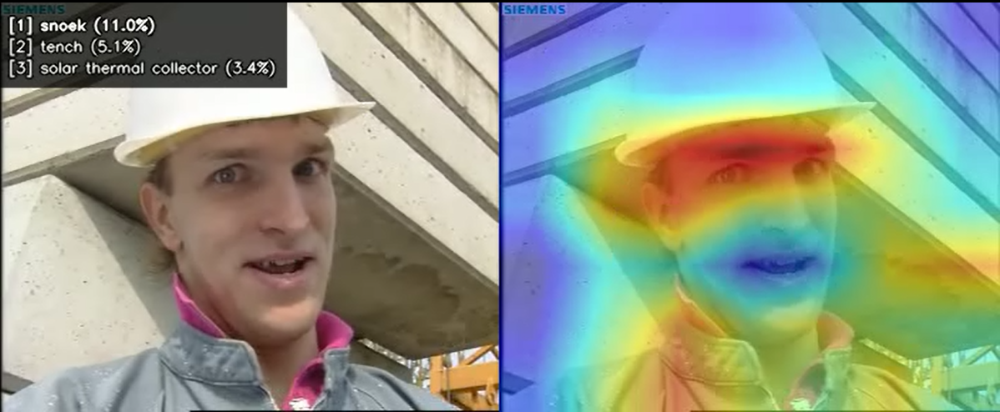
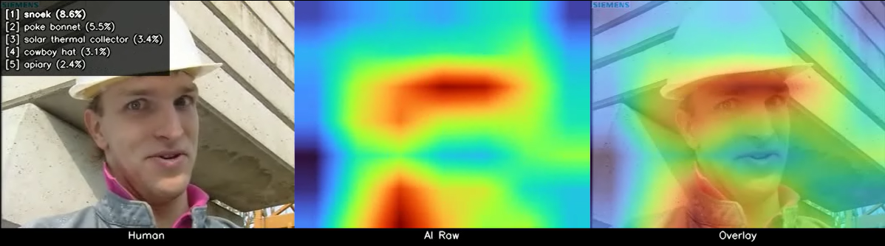

# AI Vision Visualizer

CNNが動画の各フレームで「何を見ているか」を **Grad-CAM ヒートマップ** としてオーバーレイし、動画として出力するツール。


## Demo

### sidebyside

左: 元映像、右: Grad-CAM ヒートマップオーバーレイ



### triple

左: 元映像、中: ヒートマップ単体、右: オーバーレイ



## Requirements

- Python 3.9+
- GPU 推奨 (CUDA)、CPU でも動作可

## Setup

```bash
pip install torch torchvision opencv-python numpy tqdm
```

## Usage

```bash
# 基本
python umwelt.py input.mp4

# レイアウト・カラーマップ・透明度をカスタマイズ
python umwelt.py input.mp4 -o output.mp4 \
    --layout triple \
    --alpha 0.6 \
    --colormap turbo \
    --top-k 5

# 特定クラスへの注目を可視化 (例: ImageNet "cat" = 281)
python umwelt.py input.mp4 --target-class 281 --layout sidebyside

# CPU を明示指定
python umwelt.py input.mp4 --device cpu
```

### Options

| Option | Default | Description |
|--------|---------|-------------|
| `input` | *(required)* | 入力動画ファイル |
| `-o, --output` | `{input}_umwelt.mp4` | 出力ファイルパス |
| `--layout` | `overlay` | `overlay` / `sidebyside` / `triple` |
| `--alpha` | `0.5` | ヒートマップ透明度 (0.0-1.0) |
| `--colormap` | `jet` | カラーマップ (`jet`, `hot`, `inferno`, `turbo` 等) |
| `--target-class` | auto | 対象クラス ID (0-999)。未指定時は最大確信度クラス |
| `--top-k` | `3` | 表示する予測クラス数 |
| `--show-label` | `True` | クラス名・確信度の表示 |
| `--device` | `auto` | `auto` / `cpu` / `cuda` |
| `--no-audio` | `False` | 音声を含めない |

## Architecture

```
umwelt.py          CLI・メインループ
├── gradcam.py     Grad-CAM エンジン (ResNet50 layer4)
├── renderer.py    ヒートマップ描画・レイアウト合成
└── video_io.py    動画 I/O (OpenCV)
```

**処理フロー:**

```
入力動画 → フレーム読み込み → 前処理 (224x224) → ResNet50 推論
    → Grad-CAM ヒートマップ生成 → カラーマップ変換 → 元フレームに合成
    → テキスト描画 → 出力動画に書き出し
```

## Performance

| Environment | Speed |
|-------------|-------|
| GPU (RTX 3060) | ~20-30 fps |
| GPU (RTX 4090) | ~50-80 fps |
| CPU (Core i7) | ~2-10 fps |

推論は 224x224 固定のため、入力解像度にほぼ依存しない。

## Notes

- モデルは **ResNet50** (ImageNet pretrained) 固定
- Grad-CAM の対象層は **layer4** (最終畳み込みブロック、7x7 特徴マップ)
- `ffmpeg` がインストール済みの場合、元動画の音声を自動的にコピーする
- 出力コーデックは MP4 (mp4v)

## References

- Selvaraju, R.R. et al. (2017). *Grad-CAM: Visual Explanations from Deep Networks via Gradient-based Localization.* ICCV 2017.
- He, K. et al. (2016). *Deep Residual Learning for Image Recognition.* CVPR 2016.
